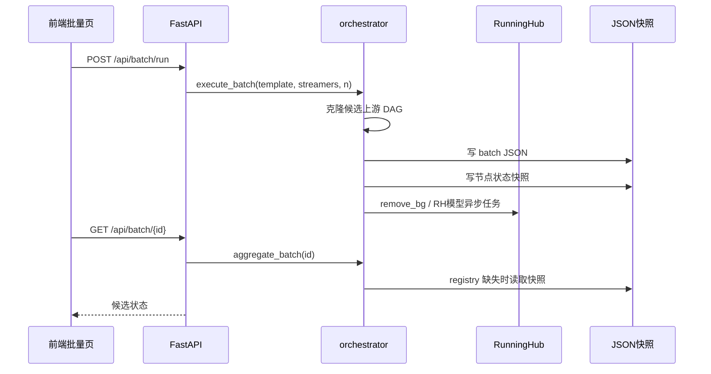

# 运营批量生产台试生产加固设计

## 背景

当前项目已经从节点 Demo 演进为“运营批量生产台 MVP”：支持画布节点、模板、主播库、批量候选图、人工采用、视频生成。但从代码核验看，主路径仍有几个阻碍试生产稳定性的短板：

1. 批量编排只读取模板第一个 `gpt_image` 的参数，并重新构造固定链路，无法复用完整上游 DAG。
2. 批量候选识别逻辑没有抽象“候选生成节点集合”，对历史 RH/Nano 独立节点模板不稳。
3. 批量失败候选不能单项重试。
4. 任务状态只存在内存 `registry`，服务重启后运行中任务无法可靠表示。
5. `remove_bg` 是 mock，没有真实抠图。
6. `index.html` 是 2700+ 行单文件，后续维护风险高。
7. `.gitignore` 未覆盖批量运行数据、临时脚本、截图等本地/运行产物。

本设计采用“方案 B：分阶段试生产加固”。目标是不推倒重来、不提前平台化，优先把当前 MVP 补成可稳定试生产版本。

## 目标

- 批量生产能复用模板中的完整上游处理链路。
- 支持 `gpt_image` 与历史 RH/Nano 独立节点类型作为候选生成节点。
- 单个失败候选可以重试，不影响整批和同主播其他候选。
- 服务重启后能恢复已完成/失败快照；运行中任务明确标记为 `interrupted` 并允许重试。
- `remove_bg` 使用 RunningHub 图片抠图工作流输出真实透明 PNG。
- 前端做机械拆分，降低单文件维护风险，不改变 UI 行为。
- 工作区运行产物不再容易误入提交。

## 非目标

- 不在本阶段引入 SQLite/队列系统。
- 不承诺 RunningHub 任务重启后完整续跑。
- 不重写前端框架，不引入 React/Vue 或构建工具。
- 不改变“候选图 → 人工采用 → 视频生成”的产品流程。
- 不删除用户已有的 `batches/`、`streamers/`、`templates/`、`canvases/` 数据文件。

## 设计总览

```mermaid
flowchart LR
    A[模板 nodes/connections] --> B[识别候选生成节点集合]
    B --> C[选定候选模板节点]
    C --> D[提取候选节点上游 DAG]
    D --> E[每个主播克隆上游 DAG]
    E --> F[复制 N 个候选生成节点]
    F --> G[execute_canvas 执行]
    G --> H[状态快照写入 runtime/tasks]
    H --> I[batch 聚合读取 registry + 快照]

    style B fill:#bbdefb,color:#0d47a1
    style D fill:#c8e6c9,color:#1a5e20
    style H fill:#fff3e0,color:#e65100
```





## 执行顺序

### 1. `.gitignore` 与工作区清理策略

#### 文件

- `e:\Poster_tuanbo\.gitignore`
- 可选删除明显临时文件：`_temp_first.js`、`_temp_second.js`、`_temp_script.js`、`_check_syntax.py`、`.tmp_console_full.png`

#### 设计

补充忽略规则：

- `batches/`
- `canvases/`
- `streamers/`
- `templates/`
- `.trae/`
- `_temp*.js`
- `_check_syntax.py`
- `.tmp*.png`
- `test_face.png`

这些是运行数据、IDE 文档、排查临时文件或测试图片。已有数据文件不主动删除；只删除明确由本轮语法排查生成的临时脚本与截图。

### 2. 批量模板支持完整上游 DAG + 多候选生成节点类型

#### 文件

- `e:\Poster_tuanbo\orchestrator.py`
- `e:\Poster_tuanbo\main.py`
- `e:\Poster_tuanbo\index.html`

#### 候选生成节点集合

定义后端候选生成节点类型集合：

```python
CANDIDATE_IMAGE_NODE_TYPES = {
    "gpt_image",
    "rh_gpt_image_i2i",
    "nano_banana_pro",
    "nano_banana_2",
}
```

说明：

- 新数据主路径仍是 `gpt_image + data.model`。
- 历史模板若仍包含独立 RH/Nano 节点类型，批量阶段也能识别为候选生成节点。
- 执行前将历史节点规范化成 `gpt_image + data.model`，避免 `_NODE_EXECUTORS` 重新注册旧类型。

#### 候选模板节点选择

第一阶段规则：

1. 从模板节点中找到所有候选生成节点。
2. 默认选择第一个候选生成节点作为“候选模板节点”。
3. 后续可扩展模板保存时指定 `candidate_node_id`，但本阶段不增加 UI 配置。

#### 上游 DAG 提取

对候选模板节点执行反向遍历：

- 从候选节点开始，沿 `connections.to == current` 找所有上游节点。
- 保留这些上游节点和它们之间的连接。
- 不保留候选节点下游节点。原因：当前产品流程是候选图人工采用后再视频生成，下游视频不应在候选阶段自动跑 N 次。

示例：

```text
模板：image_input -> remove_bg -> gpt_image -> seedance_video
批量候选阶段：image_input -> remove_bg -> N 个 gpt_image
视频阶段：采用图 -> seedance_video
```

#### 每主播克隆策略

对每个主播：

1. 克隆候选节点的上游 DAG。
2. 找到克隆后的 `image_input` 节点，把 `data.image_url` 替换为主播 `source_image_url`。
3. 移除原候选节点。
4. 复制 N 个候选节点，分别连接到原候选节点的直接上游节点。
5. 候选节点 data 使用模板候选节点 data 的深拷贝。
6. 记录：
   - `phase1_canvas_id`
   - `candidate_node_ids`
   - `candidate_template_node`
   - `phase1_nodes`
   - `phase1_connections`

保存 `phase1_nodes/phase1_connections` 是为了候选单项重试时能重建上下文。

#### 历史 RH/Nano 节点规范化

后端新增规范化函数：

```python
def normalize_node_for_execution(node):
    if node.type in legacy_model_by_type:
        node.type = "gpt_image"
        node.data.model = legacy_model_by_type[old_type]
```

这样即使旧模板没经过前端迁移，也能在批量执行时正常进入 `exec_gpt_image`。

### 3. 失败候选单项重试

#### 文件

- `e:\Poster_tuanbo\orchestrator.py`
- `e:\Poster_tuanbo\main.py`
- `e:\Poster_tuanbo\index.html`

#### API

新增请求模型：

```python
class RetryCandidateRequest(BaseModel):
    streamer_id: str
    node_id: str
```

新增接口：

```text
POST /api/batch/{batch_id}/retry-candidate
```

#### 行为

1. 加载 batch JSON。
2. 找到对应主播 item 和候选 cand。
3. 仅允许状态为 `failed`、`interrupted` 的候选重试。
4. 复用 item 中保存的 `phase1_nodes/phase1_connections`，重建一个新的 `phase1_canvas_id` 或局部 canvas。
5. 为该候选生成新节点 id，或复用原 node_id 并覆盖快照。
6. 更新 cand：
   - `status = "pending"`
   - `progress = 0`
   - `image_url = None`
   - `error = None`
7. 启动执行并保存 batch。

为降低前端引用复杂度，第一阶段建议复用原 `node_id`，但更换新的 `phase1_canvas_id` 到 item 级别会影响同主播其他候选查询。因此推荐：

- 重试候选使用新的 `retry_canvas_id` 存在 cand 上：`cand.canvas_id`。
- 聚合状态时优先使用 `cand.canvas_id`，没有则用 `item.phase1_canvas_id`。

#### 前端

- 失败候选卡片显示“重试”按钮。
- 点击重试调用新增 API。
- 重试成功后重启 batch 轮询。
- 成功候选仍点击采用。

### 4. TaskRegistry JSON 快照恢复

#### 文件

- `e:\Poster_tuanbo\orchestrator.py`

#### 存储目录

```text
runtime/tasks/
```

`.gitignore` 忽略 `runtime/`。

#### 快照内容

每个 task key 对应一个 JSON 文件。由于 key 中有 `:`，文件名使用安全编码，例如把 `:` 替换为 `__`。

节点记录保存字段：

- `task_id`
- `canvas_id`
- `node_id`
- `node_type`
- `status`
- `progress`
- `image_url`
- `mask_url`
- `error`
- `created_at`
- `updated_at`

#### 启动恢复

`TaskRegistry.__init__` 时读取 `runtime/tasks/*.json`：

- `success`、`failed`、`blocked`、`idle` 原样恢复。
- `pending`、`running` 恢复为 `interrupted`，错误信息设为“服务重启，任务已中断，请重试”。

#### 聚合逻辑

`aggregate_batch` 仍先查 `registry`。由于启动时 registry 已加载快照，重启后也能返回稳定状态。

#### 本阶段不做的事

- 不保存 RunningHub external task_id。
- 不在重启后继续轮询 RH 任务。
- 不恢复 Python 同步中的 GPT 请求。

### 5. RH remove_bg 真实抠图

#### 文件

- `e:\Poster_tuanbo\clients\rh_image.py` 或新增 `e:\Poster_tuanbo\clients\rh_remove_bg.py`
- `e:\Poster_tuanbo\orchestrator.py`
- `e:\Poster_tuanbo\config.py`
- `e:\Poster_tuanbo\.env.example`

#### RunningHub 工作流

用户提供的 AI App：

```text
workflow/app id: 1873566699474571266
endpoint: POST /openapi/v2/run/ai-app/1873566699474571266
nodeInfoList:
  - nodeId: "3"
    fieldName: "image"
    fieldValue: 上传后的图片地址或文件名
    description: "上传图片"
instanceType: "default"
usePersonalQueue: "false"
```

#### 实现流程

`exec_remove_bg` 替换 mock：

1. 读取 `params.image_url`。
2. `storage.download(ref_url)` 下载图片 bytes。
3. `runninghub.upload_image(bytes, "remove_bg.png")` 上传到 RH。
4. 提交 AI App `1873566699474571266`。
5. 轮询任务。
6. 下载首个图片结果。
7. `storage.save(png_bytes, "png")` 保存到本地 assets。
8. registry 写入新 `image_url`。

#### 配置

新增：

```python
RH_REMOVE_BG_WORKFLOW_ID = os.getenv("RH_REMOVE_BG_WORKFLOW_ID", "1873566699474571266")
RH_REMOVE_BG_POLL_INTERVAL = float(os.getenv("RH_REMOVE_BG_POLL_INTERVAL", RH_IMAGE_POLL_INTERVAL))
RH_REMOVE_BG_POLL_TIMEOUT = float(os.getenv("RH_REMOVE_BG_POLL_TIMEOUT", RH_IMAGE_POLL_TIMEOUT))
```

第一阶段不增加前端参数，`remove_bg` 节点默认使用该工作流。

### 6. 前端 CSS/JS 机械拆分

#### 文件

- `e:\Poster_tuanbo\index.html`
- 新增 `e:\Poster_tuanbo\static\styles.css`
- 新增 `e:\Poster_tuanbo\static\app.js`
- `e:\Poster_tuanbo\main.py`

#### 设计

- 从 `index.html` 提取 `<style>...</style>` 内容到 `static/styles.css`。
- 从 `index.html` 提取 `<script>...</script>` 内容到 `static/app.js`。
- `index.html` 改为：

```html
<link rel="stylesheet" href="/static/styles.css">
<script src="/static/app.js"></script>
```

- `main.py` 新增静态挂载：

```python
app.mount("/static", StaticFiles(directory="static"), name="static")
```

#### 约束

- 不改变 HTML 结构。
- 不拆 JS 模块。
- 不引入打包工具。
- 拆分后用 `node --check static/app.js` 验证语法。

## 错误处理

- 批量模板缺少候选生成节点：返回 400，提示“模板缺少候选生成节点”。
- 模板候选节点没有上游 `image_input`：返回 400，提示“候选链路缺少 image_input”。
- 候选重试时状态不是 `failed/interrupted`：返回 400，避免重复运行成功候选。
- `remove_bg` 未配置 `RUNNINGHUB_API_KEY`：节点失败并显示明确错误。
- RH 抠图成功但无图片结果：节点失败，错误写入 registry 和快照。
- 服务重启后 `pending/running` 节点标记 `interrupted`，前端按失败类状态展示并允许重试。

## 验证计划

1. `.gitignore` 验证：
   - `git status --short` 不再显示新增运行目录和临时脚本。
2. 批量模板验证：
   - 模板 `image_input -> gpt_image` 能批量生成候选。
   - 模板 `image_input -> remove_bg -> gpt_image` 能先抠图再生成候选。
   - `gpt_image.data.model = nano_banana_2` 能在批量候选中保留。
   - 历史 `type = nano_banana_2` 模板能被规范化执行。
3. 候选重试验证：
   - 人工构造失败候选，点击重试后状态回到 pending/running。
   - 重试不影响同主播其他成功候选。
4. 状态恢复验证：
   - 写入 success/failed 快照后重启服务，batch 查询仍能显示状态。
   - 写入 running 快照后重启服务，状态变为 interrupted。
5. RH remove_bg 验证：
   - 上传图片并运行 `remove_bg`，输出 URL 不等于输入 URL。
   - 输出图片能通过 `/assets/...` 访问。
6. 前端拆分验证：
   - 首页能正常加载 CSS 和 JS。
   - `node --check static/app.js` 通过。
   - 画布节点、批量页、视频页基础交互正常。
7. Python 验证：
   - `python -m py_compile main.py orchestrator.py clients/*.py` 通过。

## 实施风险与控制

- **批量 DAG 克隆风险**：节点 id 重写和连接重写容易出错。控制方式：先写小函数做深拷贝和 id 映射，保持输入输出简单。
- **重试状态引用风险**：cand 级 `canvas_id` 会让聚合逻辑更复杂。控制方式：封装 `candidate_canvas_id(item, cand)`，统一取 cand.canvas_id 或 item.phase1_canvas_id。
- **状态快照写频风险**：每次进度更新都写 JSON 会有少量 IO。当前并发只有 3，MVP 可接受。
- **RH 抠图结果格式风险**：返回 outputType 可能不是 png。控制方式：沿用 `rh_image._run_workflow_and_wait` 的“有 URL 即下载首图”策略。
- **前端拆分风险**：路径和加载顺序。控制方式：机械提取，不改变量作用域，script 放在 body 末尾。

## 自检

- 没有未定的 TBD/TODO。
- 状态恢复明确限定为快照恢复，不承诺 RunningHub 续跑。
- RH/Nano 支持明确包含历史独立节点类型和新 `gpt_image + model` 两种情况。
- 批量阶段明确只复用候选节点上游 DAG，不执行下游视频节点。
- 前端拆分限定为机械拆分，不做框架化重构。
